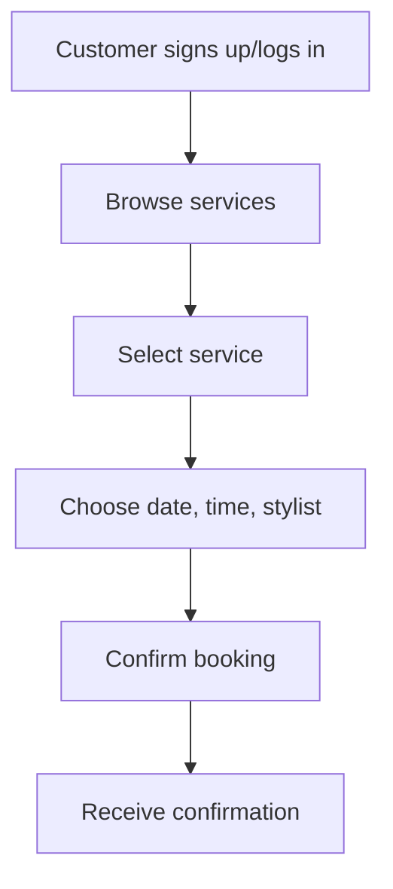
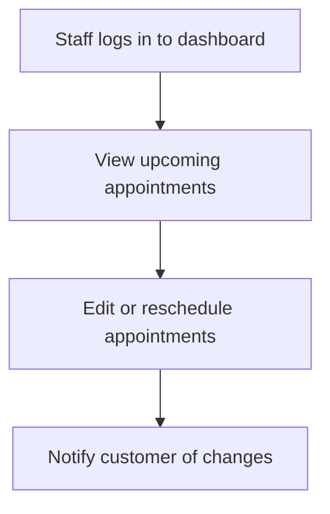

# Product Requirement Document (PRD)
## Project: Salon Web Application

### 1. Purpose
To develop a web application that enables customers to book appointments, view salon services, and manage their profiles, while allowing salon staff to manage schedules, services, and customer interactions.

### 2. Stakeholders
- Salon Owners/Managers
- Salon Staff (Stylists, Receptionists)
- Customers
- Development Team

### 3. Goals & Objectives
- Enable customers to easily browse services and book appointments online.
- Provide salon staff with tools to manage bookings, schedules, and customer information.
- Improve salon efficiency and enhance customer satisfaction.

### 4. Features

#### 4.1 Customer-Facing Features
- **User Registration & Login**
  - Sign up/sign in with email, Google, or Facebook.
- **Browse Services**
  - View list of services, prices, and durations.
- **Book Appointment**
  - Select service, stylist, date, and time.
  - Receive booking confirmation and reminders (email/SMS).
- **Profile Management**
  - Edit personal details, view appointment history.
- **Ratings & Reviews**
  - Leave ratings/reviews for services or staff.

#### 4.2 Staff/Admin Features
- **Dashboard**
  - Overview of upcoming appointments, revenue, and customer stats.
- **Manage Appointments**
  - View, edit, cancel, or reschedule appointments.
- **Manage Services**
  - Add, edit, or remove services and prices.
- **Staff Scheduling**
  - Set working hours, assign appointments.
- **Customer Management**
  - View customer profiles and appointment history.

#### 4.3 General Features
- **Responsive Design**
  - Optimized for mobile, tablet, and desktop.
- **Notifications**
  - Email/SMS notifications for confirmations, reminders, and cancellations.
- **Payment Integration**
  - Online payments via Stripe/PayPal (optional for MVP).
- **Analytics & Reporting**
  - Basic reports on bookings, revenue, and customer engagement.

### 5. User Flows

#### 5.1 Booking an Appointment

#### 5.2 Staff Managing Schedule

### 6. Technical Requirements
- **Frontend:** React.js / Angular / Vue.js
- **Backend:** Node.js (Express) / Django / Ruby on Rails
- **Database:** PostgreSQL / MySQL / MongoDB
- **Hosting:** AWS / Heroku / Azure
- **Third-party Integrations:** 
  - Payment gateway (Stripe/PayPal)
  - Email/SMS provider (SendGrid/Twilio)

### 7. Non-Functional Requirements
- **Security:** All sensitive data encrypted, GDPR compliant.
- **Performance:** Page load times < 2 seconds.
- **Scalability:** Support for up to 10,000 users.
- **Accessibility:** WCAG 2.1 compliant.

### 8. Success Metrics
- Number of bookings per month.
- User retention rate.
- Customer satisfaction (via reviews).
- Reduction in no-shows (due to reminders).

### 9. Timeline & Milestones
- Week 1-2: Requirements finalization & design
- Week 3-6: MVP development (core booking, services, user auth)
- Week 7-8: Payments & notifications
- Week 9: Testing & QA
- Week 10: Launch

### 10. Risks & Assumptions
- Reliable third-party service for email/SMS.
- User adoption depends on marketing efforts.
- Payment integration subject to approval.

---

**Prepared by:** [Your Name]  
**Date:** 2025-09-02